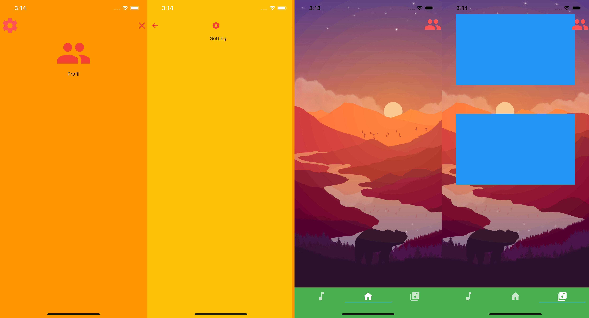

# Navigation

Ce projet contient tout ce qui concerne la structure de la navigation et les animations de transition.

- Une tab navigation avec un background unique et qui bouge avec le scroll
- Un écran profil qui transition avec un Hero
- Un écran setting

# Architecture

Utilisation de GetIt, comme ça je setup la navigation à l'initilisation puis j'y ai acces partout.

Pas de Matérial ou Cupertino Matérial Route 😡

Chaque route est généré avec un custome PageRouteBuilder 

et surtout pas en named route, j'aime pas devoir changer le onGénérateRoute pour chaque route pour pouvoir passer des arguments.

# Services

1. Navigation avec seulement: 
    - NavigateTo
    - goBack

J'ai un probleme avec le replace et la je me suis dis que j'allais rester sur la meme page apres le splaschreen, replace, une stack ça sert a rien c'est contre le patttern de stack si tu veux remplacer l'interieur d'une stack autant la faire direct.

# SubApp

1. Home avec la tab principale
    - le wrapper qui contient tout
    - un overlay widget pour les elements statique et touchable.
    - un background qui bouge en fonction du scroll de la tab.

# Button

- GoProfil pour aller dans la section profil
- GoSetting pour aller dans les settings

# Utils

1. Screen size pour avoir les dimensions de l'écran facilement
2. Responsive safe area pour avoir la taille d'un container et le mettre dans un endroit sur.